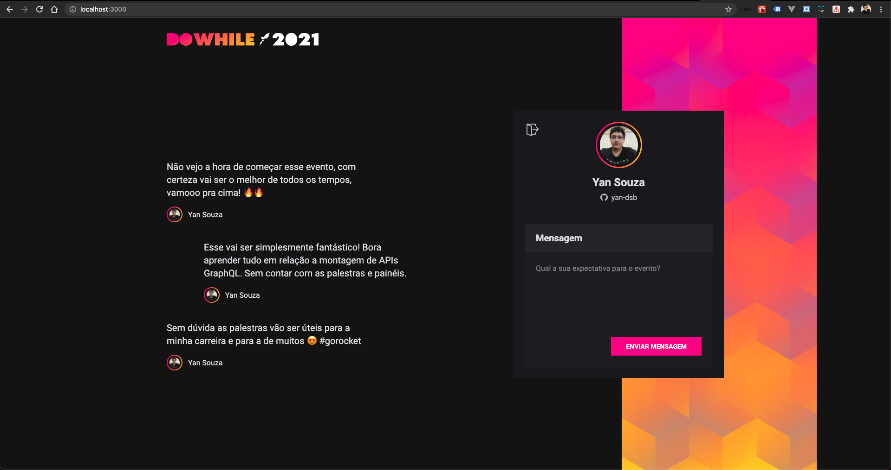

<h1>NLW Heat - ReactJS</h1>

  

## ✨ Tecnologias

Esse projeto foi desenvolvido com as seguintes tecnologias:

- [Vite](https://vitejs.dev/guide/)
- [ReactJS](https://reactjs.org/)
- [Typescript](https://www.typescriptlang.org/)
- [Axios](https://github.com/axios/axios/blob/master/README.md)
- [SASS](https://sass-lang.com/)

## 💻 Projeto

Aplicação para se conectar com a comunidade e interagir sobre o evento DoWhile 2021.

## 🚀 Como executar

- Clone o repositório
- Rode `yarn` para baixar as dependências
- Rode o `yarn dev` para iniciar a aplicação.

Após isso, a aplicação estará disponível em `http://localhost:3000`
